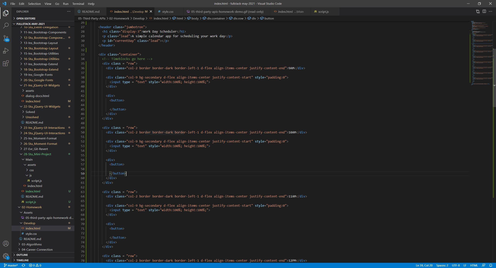
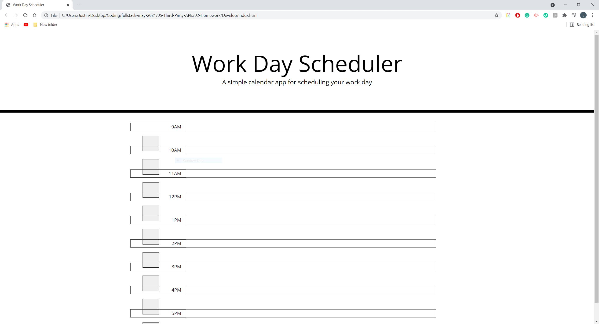
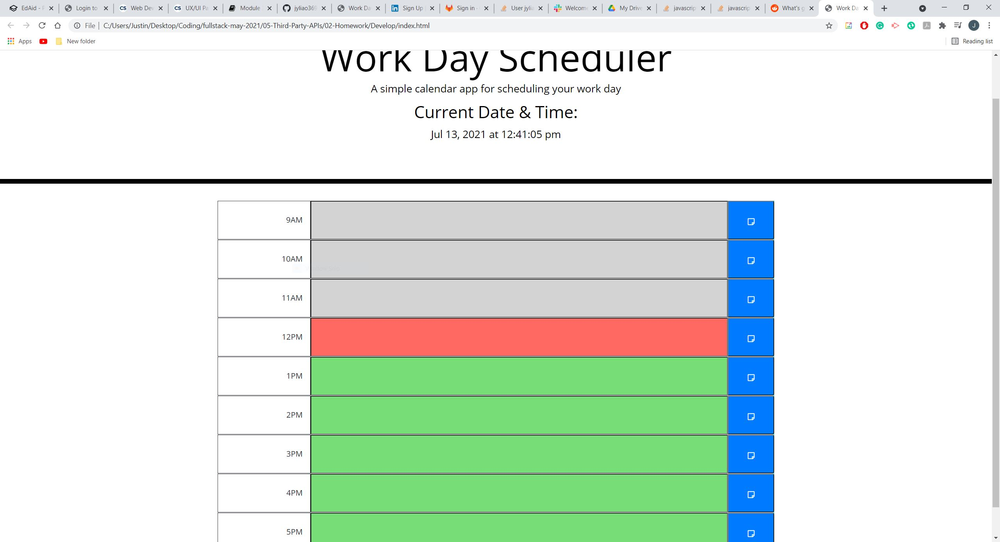
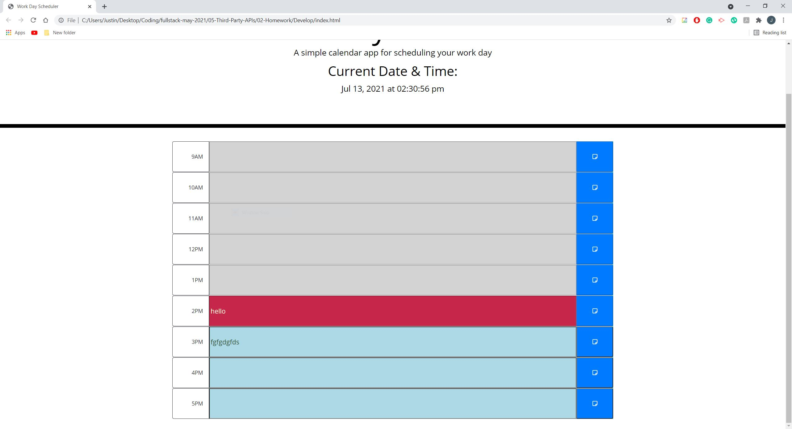
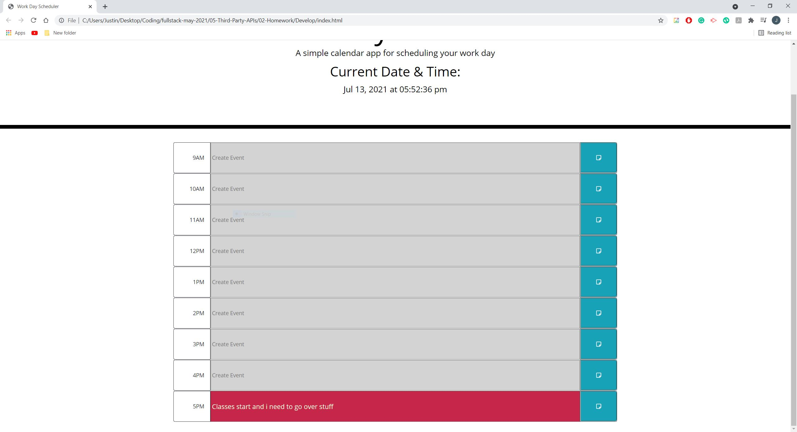
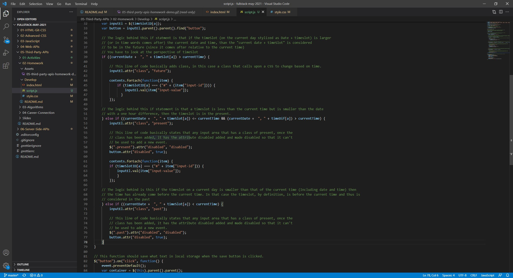
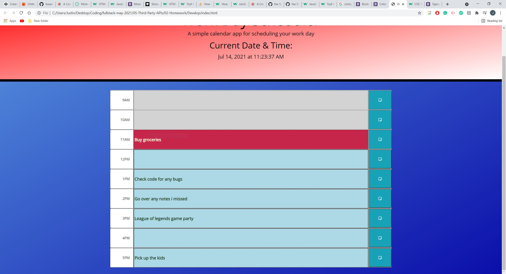

# Planner-Application - HW
Calendar/Date Planner

## Overview/Description
This project is used to help teach developer different aspects of APIs or Application programming interface. This projects mostly tests the developers knowledge on third party APIs but they will also have to use their knowlegde of all types of APIs. Other aspects of APIs they will use in their coding include JQuery and click events. 

## Goal
The goal of this project is very simple: create a simple calendar application that allows a user to save events for each hour of the day. A starter code is given and the developer must make changes in order for the application to work properlyu. This app will run in the browser and feature dynamically updated HTML and CSS powered by jQuery.

## Key Topics
* Third Party APIs
  * JQuery Elements
  * Click Events
  * Bootstrap elements
  * Google Fonts
* Web APIs
  * Local Storage
  * Preventing Default

## Learning Objectives
* Understand how to use JQuery and the Javascript Library
* HTML traversal through the use of JQuery
* Continue to learn how to use localStorage
  * Learn how to store
  * Learn how to get from localStorage
* Learn how to use Bootstrap
  * Understand that Bootstrap is a css Framework
  * Learn how to customize and style through HTML instead of CSS

## Screeshots/Image
--Basic rough draft of the Planner Application--

--Basic Application on the Browser--

--Dynamic Logic added To determine which timeslot is past, present or future--
--Current Date and Time Added--

--Add Event Logic added--

--A Completed Version of Application--

--Code of a Completed Working Application--

--Final Product of the Day Planner--

## Working Application

GitHub Site: https://github.com/jyliao369/Planner-Application

Application Website: https://jyliao369.github.io/Planner-Application/